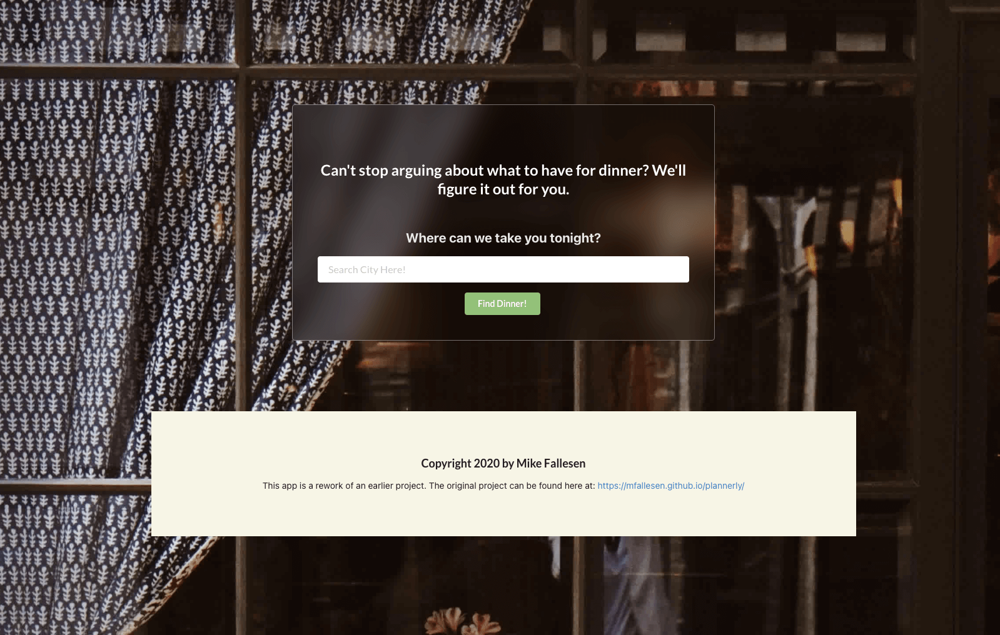
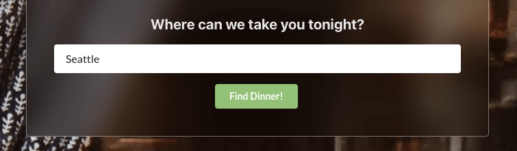
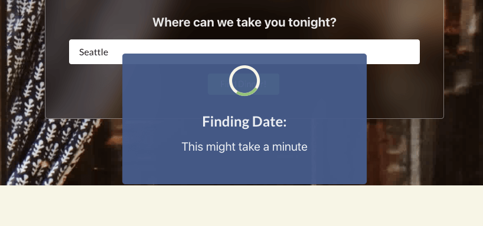
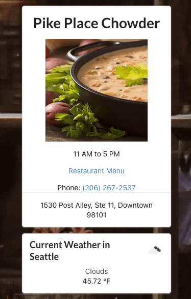

# Date Planner

## Description

  Most couples argue about one of two things. Money and what to have for dinner. While I'm not a financial expert and can't help them with the first problem, I can give them some help in overcoming their hanger at one another. The Date Planner app is a simple to use Web App that just ask users one simple uquestion. What city do you want to have dinner in? The rest is done by the app. It will find a random local restaurant (relative to the city entered) and provide you with the restaurant info as well as the local weather. This isn't just great for couples but also for locals who want to try something new in their city as well as travelers who aren't familiar with the area. 

## Content
1. [Usage](#usage)
2. [Future Development](#future)
3. [Technologies](#technologies)
4. [License](#license)
5. [Contribution and Issues](#contributing)
6. [Links](#links)

## Usage

  The user is promoted to enter a city into the search bar. The api fetches a random restaurant in the city that was entered and the local weather. There are links provided so the user can call the restaurant as well as a link to the restaurant menu if one is provided. 
  
  
  
  
  
  
  
## Future 

  There is plenty of room for improvement to this implementation. Allowing the user to search via their Geolocation for example will give much more relevant results to the user as well as limiting the search radius to something a bit more reasonable. There is also work on implementing an "event" to go either before or after dinner. whether its a movie, show, or other activity thats local. Creating a neater layout for weather along with a custom message for each weather type (such as "bring an umbrella" if there is rain forecast) is an obvious one.

  The restaurant API that was being used is no longer public but existing keys will still work to send requests. However, this means losing the ability to easily see what kinds of other requests can be made to that API. I'm looking for an alternative to Zomato but its not one of my higher priorities. 

## Technologies
* React
* Semantic UI
* Node.js
* Zomato API 
* OpenWeather API

## License

  Copyright 2021 Mike Fallesen

  Permission is hereby granted, free of charge, to any person obtaining a copy of this software and associated documentation files (the "Software"), to deal in the Software without restriction, including without limitation the rights to use, copy, modify, merge, publish, distribute, sublicense, and/or sell copies of the Software, and to permit persons to whom the Software is furnished to do so, subject to the following conditions:

  The above copyright notice and this permission notice shall be included in all copies or substantial portions of the Software.

  THE SOFTWARE IS PROVIDED "AS IS", WITHOUT WARRANTY OF ANY KIND, EXPRESS OR IMPLIED, INCLUDING BUT NOT LIMITED TO THE WARRANTIES OF MERCHANTABILITY, FITNESS FOR A PARTICULAR PURPOSE AND NONINFRINGEMENT. IN NO EVENT SHALL THE AUTHORS OR COPYRIGHT HOLDERS BE LIABLE FOR ANY CLAIM, DAMAGES OR OTHER LIABILITY, WHETHER IN AN ACTION OF CONTRACT, TORT OR OTHERWISE, ARISING FROM, OUT OF OR IN CONNECTION WITH THE SOFTWARE OR THE USE OR OTHER DEALINGS IN THE SOFTWARE.

## Contributing

  I'm always open to feedback and would love to hear from you if you've got suggestions for improvements you'd like to see or if you encounter any issues while running this. If you find one Please be sure to use the issues tab in the repo to let me know.

## Questions

  Got any pressing questions or comments? Reach me directly at mfallesen2010@gmail.com.
  
## Comments

  This is a rework of a previous app found [here](https://mfallesen.github.io/plannerly/) with its accompanying GitHub [Repo](https://github.com/mfallesen/plannerly).

## Links
[The Application](https://date-plannerly.herokuapp.com/)

[Front End Repo](https://github.com/mfallesen/date-planner)

[API Repo](https://github.com/mfallesen/date-planner-api)
